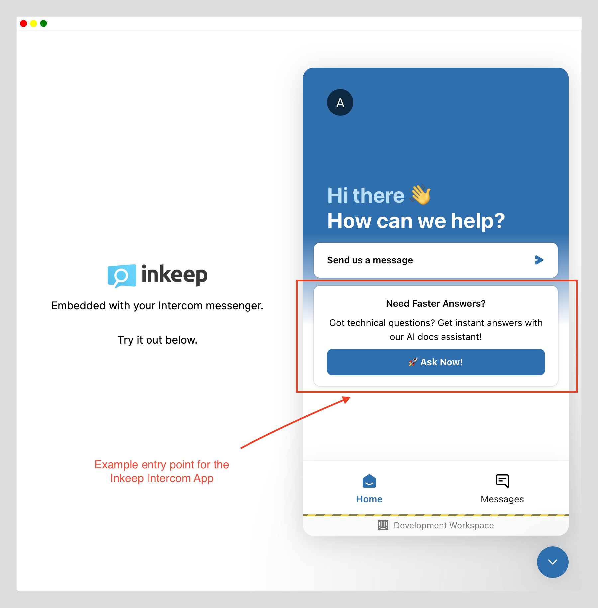
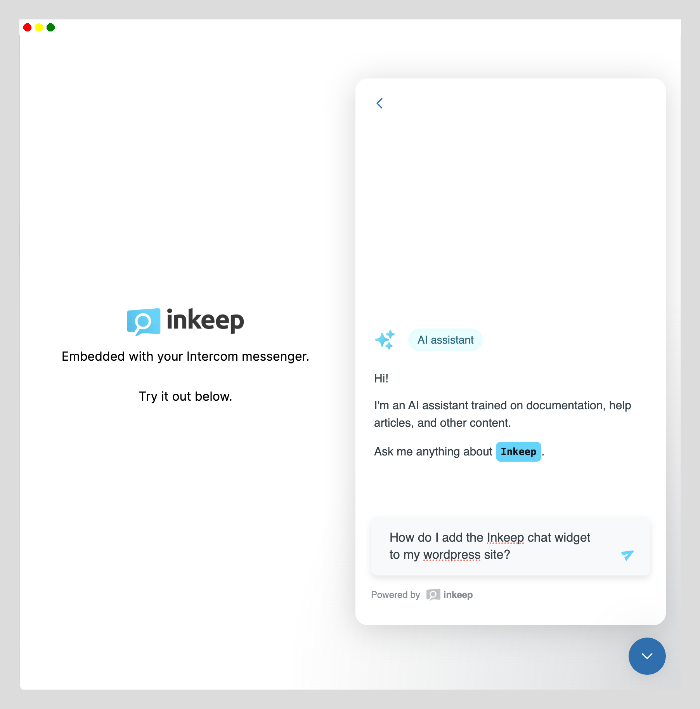
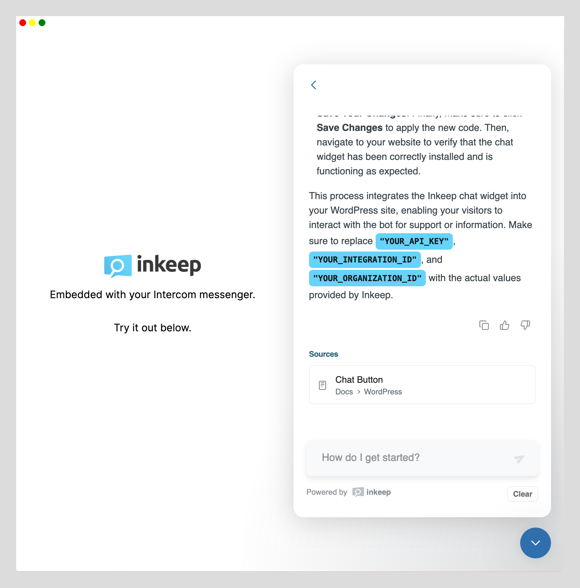

# Inkeep Intercom Application Template

This repository demonstrates how to integrate Inkeep's AI Documentation Chat widget within your existing Intercom messenger. This is ideal if you don't want to stop using Intercom and you don't want two different messenger widgets on your web page. This solution provides a UI-friendly way for users to engage with the Inkeep widget through an existing Intercom messenger.

### Key Features:
- **Single Messenger Widget**: Avoid the clutter of multiple widgets by embedding Inkeep within Intercom.
- **User-Friendly Interface**: Simplified interaction with the Inkeep embedded widget through Intercom.
- **Analytics and Usage**: Track performance and usage in the Inkeep dashboard.
- **Configurable Entry Point**: Customize the entry point for the Inkeep widget using the Intercom Canvas Kit API.

For setup instructions, refer our detailed setup instructions below.

By deploying this template and configuring a new intercom app you will be able to embed the Inkeep chat within your Intercom messenger seamlessly.

You can customize the Inkeep-Intercom app using elements from the [Intercom Canvas Kit](https://developers.intercom.com/docs/canvas-kit) and redefining the canvas object within the initlialize endpoint.

Using Intercom's Messenger Dashboard, you will be able to conditionally show/hide the Inkeep Intercom app based on various user and visitor properties.

## Deploy to Vercel
[](https://vercel.com/new/clone?repository-url=https%3A%2F%2Fgithub.com%2Finkeep%2Finkeep-within-intercom&env=NEXT_PUBLIC_INTERCOM_APP_ID,INKEEP_API_KEY,INKEEP_INTEGRATION_ID,INKEEP_ORGANIZATION_ID&envDescription=API%20Keys%20needed%20for%20setting%20up%20the%20Inkeep%20Chat&envLink=https%3A%2F%2Fdocs.inkeep.com%2Fintegrations%2Fnextjs%2Fembedded-chat%23get-an-inkeep-api-key&project-name=my-inkeep-intercom-app&repository-name=my-inkeep-intercom-app)

## Local Development; Getting Started

First, run the development server:

```bash
npm run dev
# or
yarn dev
# or
pnpm dev
# or
bun dev
```

Open [http://localhost:3000](http://localhost:3000) with your browser to see the result.

## Step-by-Step Guide

1. **Click "Deploy to Vercel"**:
   - [](https://vercel.com/new/clone?repository-url=https%3A%2F%2Fgithub.com%2Finkeep%2Finkeep-within-intercom&env=NEXT_PUBLIC_INTERCOM_APP_ID,INKEEP_API_KEY,INKEEP_INTEGRATION_ID,INKEEP_ORGANIZATION_ID&envDescription=API%20Keys%20needed%20for%20setting%20up%20the%20Inkeep%20Chat&envLink=https%3A%2F%2Fdocs.inkeep.com%2Fintegrations%2Fnextjs%2Fembedded-chat%23get-an-inkeep-api-key&project-name=my-inkeep-intercom-app&repository-name=my-inkeep-intercom-app)

2. **Get Variables**:
   - **a.** `NEXT_PUBLIC_INTERCOM_APP_ID` is the Intercom workspace ID. [Learn how to find your App ID here](https://community.intercom.com/messenger-8/where-i-can-get-my-app-id-4021).
   - **b.** `INKEEP_API_KEY`, `INKEEP_INTEGRATION_ID`, `INKEEP_ORGANIZATION_ID` are the API keys for the Inkeep API. [Learn how to get your API keys here](https://docs.inkeep.com/integrations/nextjs/embedded-chat#get-an-inkeep-api-key).

3. **Complete the vercel deployment**.

4. **Create and Configure a new Intercom App**:
   - **4.1.** Configure the new app:
     https://developers.intercom.com/docs/build-an-integration/getting-started/build-an-app-for-your-messenger/#add-the-webhooks 

     - Initialize flow Webhook url:  `{ Vercel Deployment Domain}/api/initialize` 
     - Submit flow Webhook url:  `{ Vercel Deployment Domain}/api/submit` 

5. **Configure the messenger to display the app**.
   - Follow this guide to add your new app to the messenger: [Customize your messenger home with apps](https://www.intercom.com/help/en/articles/1827291-customize-your-messenger-home-with-apps)
6. **Test it out**.
   - Go to a page where your intercom messenger is shown or open your vercel deployment homepage to give it a test drive.

## Live Demo:
[Try a live demo using Inkeep's Intercom and Inkeep's docs here](https://inkeep-within-intercom.vercel.app/)




```